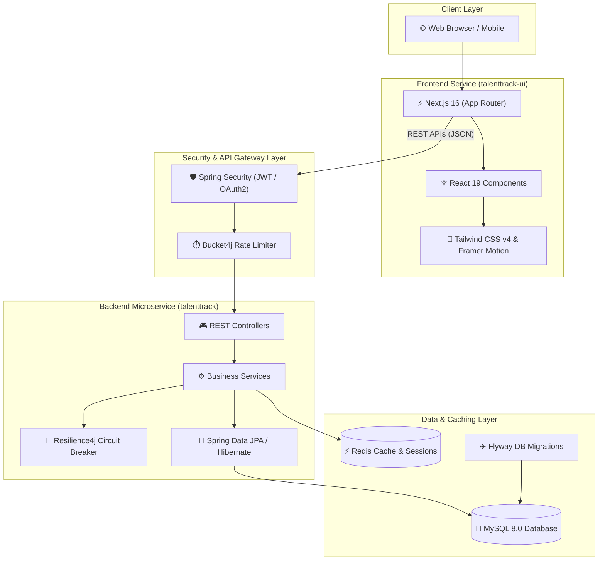

<div align="center">

# 🎯 TalentTrack

### *Next-Generation Enterprise Talent Acquisition & Applicant Tracking System (ATS)*

[](https://spring.io/projects/spring-boot)
[](https://www.oracle.com/java/)
[](https://nextjs.org/)
[](https://react.dev/)
[](https://tailwindcss.com/)
[](https://www.mysql.com/)
[](https://redis.io/)
[](LICENSE)

---

[Key Features](#-key-features) •
[System Architecture](#-system-architecture) •
[Tech Stack](#-tech-stack) •
[Project Structure](#-project-structure) •
[Getting Started](#-getting-started) •
[API Documentation](#-api-documentation) •
[Security & Resilience](#-security--resilience)

</div>

---

## 📌 Overview

**TalentTrack** is an enterprise-grade, high-performance Applicant Tracking System (ATS) and Recruitment Management Platform. Designed for talent acquisition teams, hiring managers, and candidates, TalentTrack streamlines the end-to-end recruitment lifecycle from job requisition creation to offer management and onboarding.

Built as a modern **decoupled full-stack monorepo**, TalentTrack combines a robust, fault-tolerant **Spring Boot 3** backend with a lightning-fast, reactive **Next.js 16** frontend powered by React 19, Framer Motion, and Tailwind CSS v4.

---

## ✨ Key Features

### 💼 Job Requisition & Posting Lifecycle
- **Dynamic Job Management**: Create, edit, publish, archive, and delete job openings with custom requirements, salary ranges, employment types, and location tags.
- **Advanced Filtering & Search**: Instant candidate search across skills, experience level, and application status.

### 📑 Candidate Application Pipeline
- **Seamless Application Portal**: Interactive application submission process for candidate profiles and resumes.
- **Pipeline Stage Tracking**: Move applicants across customizable workflow stages (*Applied*, *Screening*, *Interviewing*, *Offer Extended*, *Hired*, *Rejected*).

### 📅 Interview Scheduling & Feedback
- **Panel Assignment & Slot Booking**: Coordinate interview rounds between candidates and internal hiring panels.
- **Structured Feedback Scorecards**: Record interviewer evaluations, ratings, and recommendations directly within candidate profiles.

### 🔒 Enterprise Authentication & Access Control
- **Dual Authentication**: Dual support for stateless **JWT (JSON Web Tokens)** with access/refresh token rotation and **Google OAuth2 Single Sign-On (SSO)**.
- **Role-Based Access Control (RBAC)**: Fine-grained permissions for Candidates, Recruiters, Hiring Managers, and Administrators.

### ⚡ High Performance & Redis Caching
- **Distributed Session & Query Caching**: Powered by Redis to accelerate job searches and reduce database query load.
- **Database Migrations**: Automatic, version-controlled schema migrations using **Flyway**.

### 🛡️ Resilience & Rate Limiting
- **API Rate Limiting**: Built-in **Bucket4j** rate limiting to prevent brute-force attacks and service degradation.
- **Circuit Breakers & Retries**: Integrated **Resilience4j** circuit breakers to handle external dependency failures gracefully.

### 📜 Immutable Security Audit Logging
- Comprehensive audit trails capturing system operations, user activities, status changes, and compliance events.

### 📖 Interactive OpenAPI / Swagger Specs
- Interactive documentation UI available at runtime via **Springdoc OpenAPI 3.0**.

---

## 🏗️ System Architecture



---

## 🛠️ Tech Stack

| Category | Technology | Description |
| :--- | :--- | :--- |
| **Backend Framework** | Spring Boot `3.3.2` | Core Enterprise Java Framework |
| **Language** | Java `17` | Long-Term Support (LTS) JDK |
| **Frontend Framework**| Next.js `16.3.0` | React Framework with App Router |
| **UI Library** | React `19.2.8` | Modern UI Components |
| **Styling & Motion** | Tailwind CSS `v4`, Framer Motion, GSAP | Utility-first styling & fluid micro-animations |
| **Database** | MySQL `8.0` | Relational Data Storage |
| **Database Migrations**| Flyway DB | Version-controlled Schema Management |
| **Cache & Sessions** | Redis | High-speed In-Memory Cache |
| **Security** | Spring Security, JJWT `0.12.5`, OAuth2 | Authentication & Authorization |
| **Fault Tolerance** | Resilience4j `2.2.0`, Bucket4j `8.19.0` | Circuit Breaking & Rate Limiting |
| **API Docs** | Springdoc OpenAPI `2.5.0` | Swagger UI & OpenAPI 3 Specs |
| **Testing** | Testcontainers `1.19.8`, JUnit 5 | Containerized Database Integration Testing |

---

## 📂 Project Structure

```
TalentTrack/
├── talenttrack/                        # Spring Boot Backend Service
│   ├── src/
│   │   ├── main/
│   │   │   ├── java/com/umesh/talenttrack/
│   │   │   │   ├── config/             # Security, Redis, Swagger, & CORS Configs
│   │   │   │   ├── controller/         # REST API Controllers (Auth, Jobs, Apps, Audit)
│   │   │   │   ├── domain/             # JPA Entities & Enums
│   │   │   │   ├── dto/                # Request / Response Data Transfer Objects
│   │   │   │   ├── exception/          # Global Exception Handler & Custom Errors
│   │   │   │   ├── repository/         # Spring Data JPA Repositories
│   │   │   │   ├── security/           # JWT Filters, UserDetails, & OAuth2 Handlers
│   │   │   │   └── service/            # Core Business Logic Services
│   │   │   └── resources/
│   │   │       ├── db/migration/       # Flyway Database Migration Scripts
│   │   │       └── application-local.yml
│   │   └── test/                       # Unit & Integration Tests (Testcontainers)
│   ├── mvnw & mvnw.cmd                 # Maven Wrapper Scripts
│   └── pom.xml                         # Backend Dependencies & Plugins
│
├── talenttrack-ui/                     # Next.js Frontend Application
│   ├── src/
│   │   ├── app/                        # App Router (Pages: login, register, candidate, recruiter)
│   │   ├── components/                 # Reusable UI Components (Hero, Features, Stats, Marquee)
│   │   └── lib/                        # API Client & Utility Functions
│   ├── public/                         # Static Assets & Icons
│   ├── package.json                    # Node Dependencies & Scripts
│   └── tailwind.config.ts              # Tailwind Styling Configuration
│
├── .gitignore                          # Global Monorepo Git Ignore Rules
├── LICENSE                             # MIT Open Source License
└── README.md                           # Enterprise Documentation
```

---

## 🚀 Getting Started

### Prerequisites

Ensure you have the following installed on your development machine:
- **JDK 17** or higher (`java -version`)
- **Node.js 18+** and `npm` (`node -v`)
- **Maven 3.8+** (or use included `./mvnw`)
- **MySQL 8.0+** running locally on port `3306`
- **Redis Server** running locally on port `6379`

---

### 1. Backend Setup (`talenttrack`)

1. **Navigate to the backend directory**:
   ```bash
   cd talenttrack
   ```

2. **Configure Database & Credentials**:
   Ensure MySQL database `talenttrack` exists or allow auto-creation. Adjust configuration in `src/main/resources/application-local.yml` if necessary:
   ```yaml
   spring:
     datasource:
       url: jdbc:mysql://localhost:3306/talenttrack?createDatabaseIfNotExist=true
       username: root
       password: password
     data:
       redis:
         host: localhost
         port: 6379
   ```

3. **Build the Application**:
   ```bash
   ./mvnw clean package -DskipTests
   ```

4. **Run the Backend Service**:
   ```bash
   ./mvnw spring-boot:run -Dspring-boot.run.profiles=local
   ```
   The backend API will start on **`http://localhost:8080`**.

---

### 2. Frontend Setup (`talenttrack-ui`)

1. **Navigate to the frontend directory**:
   ```bash
   cd talenttrack-ui
   ```

2. **Install Dependencies**:
   ```bash
   npm install
   ```

3. **Launch Development Server**:
   ```bash
   npm run dev
   ```
   The frontend application will start on **`http://localhost:3000`**.

---

## 📡 API Documentation

Once the backend is running, explore and test live REST API endpoints via Swagger UI:

- **Swagger UI**: [`http://localhost:8080/swagger-ui.html`](http://localhost:8080/swagger-ui.html)
- **OpenAPI JSON**: [`http://localhost:8080/v3/api-docs`](http://localhost:8080/v3/api-docs)

### Core REST Endpoints Summary

| Method | Endpoint | Description | Access |
| :--- | :--- | :--- | :--- |
| `POST` | `/api/v1/auth/register` | Register a new candidate or recruiter account | Public |
| `POST` | `/api/v1/auth/login` | Authenticate and receive JWT access/refresh tokens | Public |
| `POST` | `/api/v1/auth/refresh` | Refresh expired access tokens using refresh token | Public |
| `GET` | `/api/v1/jobs` | Fetch published job postings with pagination & search | Public |
| `POST` | `/api/v1/jobs` | Create a new job requisition | Recruiter / Admin |
| `GET` | `/api/v1/applications` | List applicant submissions for recruiter pipeline | Recruiter / Admin |
| `POST` | `/api/v1/applications` | Submit application for a job opening | Candidate |
| `POST` | `/api/v1/interviews` | Schedule candidate interview round | Recruiter |
| `GET` | `/api/v1/audit-logs` | Retrieve compliance and activity audit logs | Admin |

---

## 🛡️ Security & Resilience

- **Stateless JWT Security**: Requests to protected endpoints require an `Authorization: Bearer <access_token>` header.
- **Bucket4j Rate Limiting**: Enforces strict request quotas per IP address to safeguard against Denial of Service (DoS) attacks.
- **Resilience4j Circuit Breakers**: Protects system availability by gracefully opening circuits when external integrations fail.
- **Audit Compliance**: All sensitive domain mutations automatically create immutable records in `AuditLog`.

---

## 📄 License

This project is licensed under the **MIT License** - see the [LICENSE](LICENSE) file for details.

---

<div align="center">

Crafted with ❤️ by **[Umesh Sai Hanuma Prasad Syamala](https://github.com/Umesh-369)**

</div>
